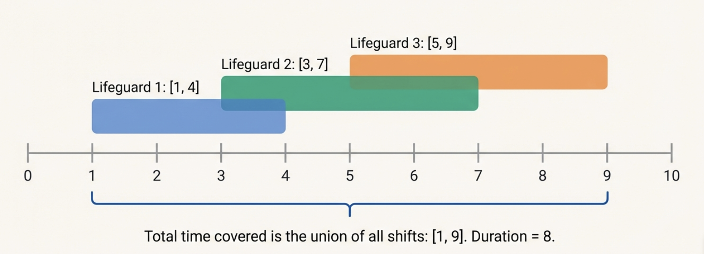
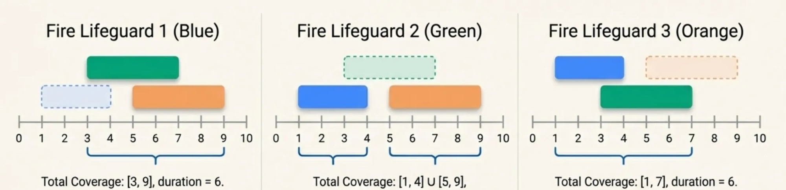
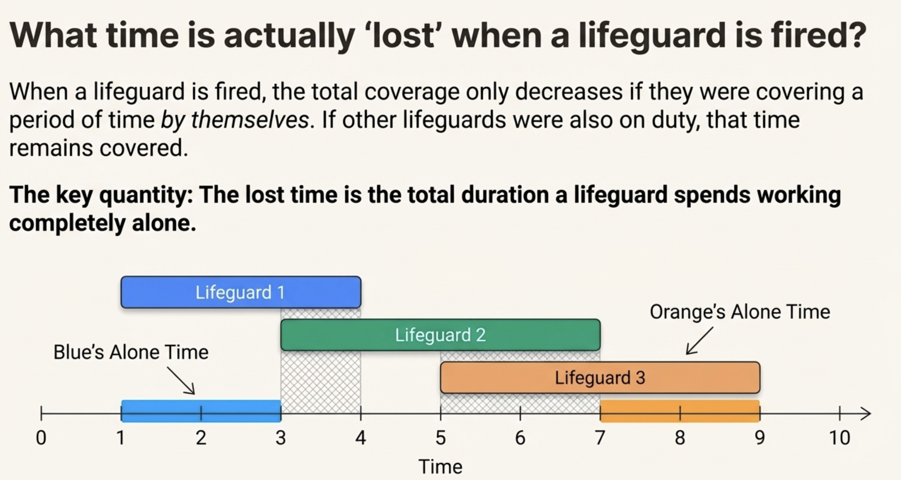
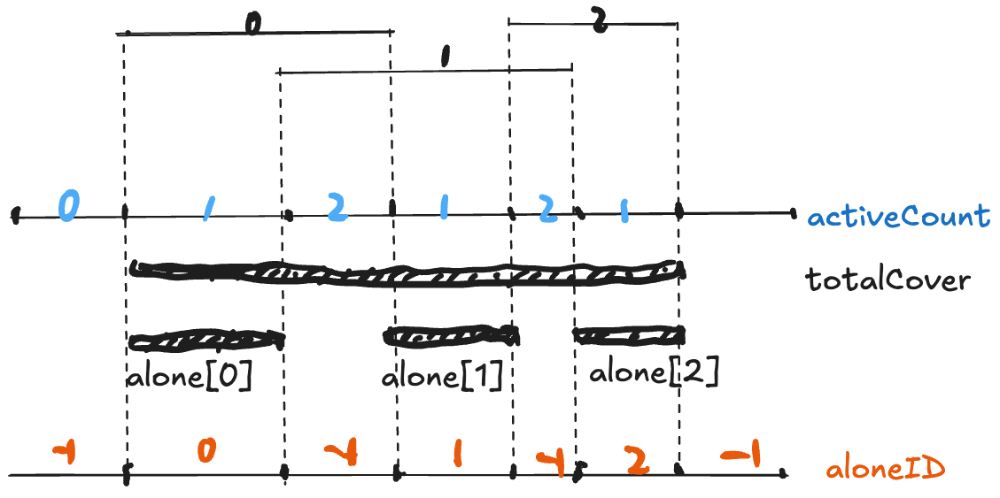

# Lifeguards

[https://usaco.org/index.php?page=viewproblem2\&cpid=786](https://usaco.org/index.php?page=viewproblem2\&cpid=786)

<details>

<summary>Read problem: Storyless Version</summary>

> You are given **N intervals** on the number line, each defined by two distinct integers $$s_i, e_i$$ with $$0 \le s_i < e_i \le 1{,}000{,}000{,}000)$$. These intervals may overlap.
>
> You must **remove exactly one interval**.
>
> After removing one interval, the **coverage** is defined as the total length of the union of the remaining $N-1$ intervals.
>
> **Task:**
>
> Compute the **maximum possible coverage** after removing exactly one interval.
>
> ***
>
> #### **Input Format**
>
> * The first line contains an integer $$N, (1 \le N \le 100{,}000)$$.
> * Each of the next $$N$$ lines contains two integers $$s_i, e_i$$, the start and end of an interval.
>
> All interval endpoints are distinct.
>
> ***
>
> #### **Output Format**
>
> Print a single integer: the maximum length of the union of the intervals after removing exactly one interval.

</details>

<details>

<summary>BruteForce</summary>

<figure><figcaption></figcaption></figure>

<figure><figcaption></figcaption></figure>

```java
import java.io.*;
import java.util.*;

public class lifeguards_bruteforce {
    public static void main(String[] args) throws IOException {
        BufferedReader br = new BufferedReader(new FileReader("lifeguards.in"));
        PrintWriter pw = new PrintWriter(new FileWriter("lifeguards.out"));

        int n = Integer.parseInt(br.readLine());
        int[][] intervals = new int[n][2];
        int maxTime = 0;

        for (int i = 0; i < n; i++) {
            String[] parts = br.readLine().split(" ");
            intervals[i][0] = Integer.parseInt(parts[0]);
            intervals[i][1] = Integer.parseInt(parts[1]);
            maxTime = Math.max(maxTime, intervals[i][1]);
        }

        int maxCover = 0;

        for (int remove = 0; remove < n; remove++) {
            boolean[] covered = new boolean[maxTime + 1];

            for (int i = 0; i < n; i++) {
                if (i == remove) continue; // remove this lifeguard
                for (int t = intervals[i][0]; t < intervals[i][1]; t++) {
                    covered[t] = true;
                }
            }
            int cover = 0;
            for (boolean c : covered) {if (c) cover++;}
            maxCover = Math.max(maxCover, cover);
        }

        pw.println(maxCover);
        pw.close();
        br.close();
    }
}
```


```java
import java.io.*;
import java.util.*;

public class lifeguards_bruteforce {
    public static void main(String[] args) throws IOException {
        BufferedReader br = new BufferedReader(new FileReader("lifeguards.in"));
        PrintWriter pw = new PrintWriter(new FileWriter("lifeguards.out"));

        int n = Integer.parseInt(br.readLine());
        int[][] intervals = new int[n][2];
        int maxTime = 0;

        for (int i = 0; i < n; i++) {
            String[] parts = br.readLine().split(" ");
            intervals[i][0] = Integer.parseInt(parts[0]);
            intervals[i][1] = Integer.parseInt(parts[1]);
            maxTime = Math.max(maxTime, intervals[i][1]);
        }

        int maxCover = 0;

        for (int remove = 0; remove < n; remove++) {
            boolean[] covered = new boolean[maxTime + 1];

            for (int i = 0; i < n; i++) {
                if (i == remove) continue; // remove this lifeguard
                for (int t = intervals[i][0]; t < intervals[i][1]; t++) {
                    covered[t] = true;
                }
            }
            int cover = 0;
            for (boolean c : covered) {if (c) cover++;}
            maxCover = Math.max(maxCover, cover);
        }

        pw.println(maxCover);
        pw.close();
        br.close();
    }
}
```


</details>

<details>

<summary>Optimization</summary>

<figure><figcaption></figcaption></figure>

<figure><figcaption></figcaption></figure>

```java
import java.io.*;
import java.util.*;

public class lifeguards_silver_jan18 {

    static class Event implements Comparable<Event> {
        int time, id;
        boolean start;
        Event(int time, int id, boolean start) {
            this.time = time;
            this.id = id;
            this.start = start;
        }
        public int compareTo(Event other) {
            return this.time - other.time;
        }
    }

    public static void main(String[] args) throws IOException {
        Kattio io = new Kattio("lifeguards");

        int n = io.nextInt();
        Event[] events = new Event[2 * n];

        // Read intervals and create start/end events
        for (int i = 0; i < n; i++) {
            int start = io.nextInt();
            int end = io.nextInt();
            events[2*i] = new Event(start, i, true);
            events[2*i + 1] = new Event(end, i, false);
        }

        Arrays.sort(events);

        int totalCover = 0;
        int[] alone = new int[n];
        boolean[] active = new boolean[n]; // tracks which lifeguards are active
        int activeCount = 0;               // number of active lifeguards
        int lastTime = 0;
        int aloneId = -1;                   // id of the lifeguard who is alone

        for (Event e : events) {
            // Add covered time since last event
            if (activeCount > 0) {
                totalCover += e.time - lastTime;
            }

            // Add alone time for the lifeguard who is alone
            if (activeCount == 1 && aloneId != -1) {
                alone[aloneId] += e.time - lastTime;
            }

            // Update active lifeguards
            if (e.start) {
                active[e.id] = true;
                activeCount++;
            } else {
                active[e.id] = false;
                activeCount--;
            }

            // Determine who is alone, if exactly one lifeguard is active
            if (activeCount == 1) {
                for (int i = 0; i < n; i++) {
                    if (active[i]) {
                        aloneId = i;
                        break;
                    }
                }
            } else {
                aloneId = -1; // none or more than one active
            }

            lastTime = e.time;
        }

        // Maximum coverage after firing one lifeguard
        int maxCover = 0;
        for (int timeAlone : alone) {
            maxCover = Math.max(maxCover, totalCover - timeAlone);
        }

        io.println(maxCover);
        io.flush();
    }

    // --- Kattio class for fast IO ---
    static class Kattio extends PrintWriter {
        private BufferedReader r;
        private StringTokenizer st;
        public Kattio() { this(System.in, System.out); }
        public Kattio(InputStream i, OutputStream o) { super(o); r = new BufferedReader(new InputStreamReader(i)); }
        public Kattio(String problemName) throws IOException { super(problemName + ".out"); r = new BufferedReader(new FileReader(problemName + ".in")); }
        public String next() {
            try { while (st == null || !st.hasMoreTokens()) st = new StringTokenizer(r.readLine()); return st.nextToken(); }
            catch (Exception e) {} return null;
        }
        public int nextInt() { return Integer.parseInt(next()); }
        public long nextLong() { return Long.parseLong(next()); }
        public double nextDouble() { return Double.parseDouble(next()); }
    }
}

```

</details>

<details>

<summary>Treeset Optimization</summary>

```java
import java.io.*;
import java.util.*;

public class lifeguards {
    static class Event implements Comparable<Event> {
        public int time, id;
        public Event(int time, int id) { this.time = time; this.id = id; }
        public int compareTo(Event other) { return this.time - other.time; }
    }

    public static void main(String[] args) throws IOException {
        Kattio io = new Kattio("lifeguards");

        int n = io.nextInt();
        Event[] events = new Event[2 * n];

        for (int i = 0; i < n; i++) {
            int start = io.nextInt();
            int end = io.nextInt();
            events[2*i] = new Event(start, i);
            events[2*i + 1] = new Event(end, i);
        }

        Arrays.sort(events, 0, 2*n);

        TreeSet<Integer> active = new TreeSet<>();
        int totalCover = 0;
        int[] alone = new int[n];
        int lastTime = 0;

        for (Event e : events) {
            if (active.size() == 1) {
                alone[active.first()] += e.time - lastTime;
            }
            if (!active.isEmpty()) {
                totalCover += e.time - lastTime;
            }

            if (active.contains(e.id)) active.remove(e.id);
            else active.add(e.id);

            lastTime = e.time;
        }

        int maxCover = 0;
        for (int timeAlone : alone) {
            maxCover = Math.max(maxCover, totalCover - timeAlone);
        }

        io.println(maxCover);
        io.flush();
    }

    // --- Kattio class ---
    static class Kattio extends PrintWriter {
        private BufferedReader r;
        private StringTokenizer st;
        public Kattio() { this(System.in, System.out); }
        public Kattio(InputStream i, OutputStream o) { super(o); r = new BufferedReader(new InputStreamReader(i)); }
        public Kattio(String problemName) throws IOException { super(problemName + ".out"); r = new BufferedReader(new FileReader(problemName + ".in")); }
        public String next() {
            try { while (st == null || !st.hasMoreTokens()) st = new StringTokenizer(r.readLine()); return st.nextToken(); }
            catch (Exception e) {} return null;
        }
        public int nextInt() { return Integer.parseInt(next()); }
        public long nextLong() { return Long.parseLong(next()); }
        public double nextDouble() { return Double.parseDouble(next()); }
    }
}

```

</details>
